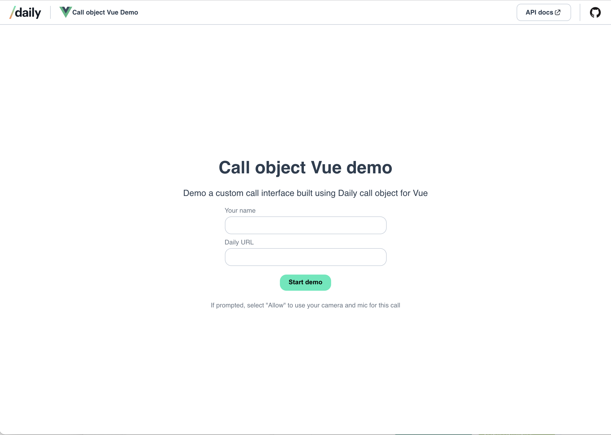

# Vue + Daily call object (custom) video call demo

This project demonstrates how to build a custom video call with Daily's custom [call object](https://docs.staging.daily.co/call-object) mode using [Vue.js](https://vuejs.org/).



To view a deployed example of this demo, visit [https://vue-call-object.netlify.app](https://vue-call-object.netlify.app).

---

## Running this demo locally

Clone this repo and, from the project directory, run:

```bash
npm install
npm run dev
```

Open http://localhost:8080 to view it in the browser.

## Getting set up with Daily

To use this demo, you will need a Daily room to join.

To get a Daily room URL, [create a Daily account](https://dashboard.daily.co/signup).

Once you have an account and are logged into the [Daily Dashboard](https://dashboard.daily.co), you can [create a new Daily room](https://dashboard.daily.co/rooms/create).

Copy the new room's URL. You can use this in the form on the home page.

The room URL will be in the following format:

`https://<your-daily-domain>.daily.co/<room-name>`

---

## Features

This demo demonstrates how to build a video call in Vue with the following features:

- multi-participant calls
- local participant controls to:
  - control camera and microphone devices
  - share your screen (a limit of 1 screen share at a time is enforced here for simplicity)
  - leave the current call
- join any Daily call
- set your username before joining the call

### Ideas for expanding this demo

Some features that could be added to this demo include:

- Adding [prejoin UI](https://www.daily.co/blog/build-your-own-prejoin-call-ui-in-a-custom-daily-video-chat-app/) to test devices and see your local video before joining
- Allowing users to create rooms via the app using Daily's [REST API](https://docs.staging.daily.co/reference/rest-api/rooms)
- Managing meeting permissions via [room settings](https://docs.staging.daily.co/guides/controlling-who-joins-a-meeting), like making the call a [broadcast call](https://www.daily.co/blog/daily-prebuilt-broadcast-call-deep-dive/)

---

## Related blog posts/tutorials

Learn more about this demo on the [Daily blog](https://www.daily.co/blog/tag/vue/).

- [Build a custom video chat app with Daily and Vue.js](https://www.daily.co/blog/custom-video-chat-app-with-daily-and-vue/)
- [Build a custom chat widget in Vue with Daily’s sendAppMessage](https://www.daily.co/blog/build-a-custom-chat-widget-with-vue-with-dailys-sendappmessage-method/)
